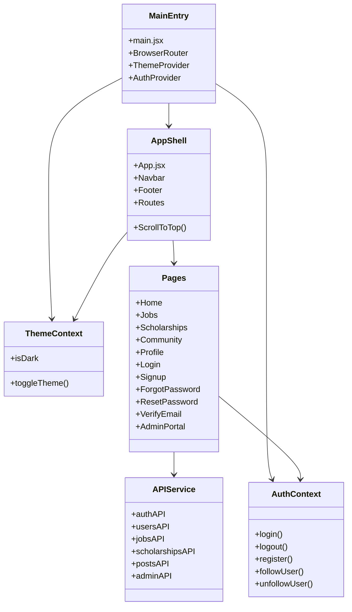
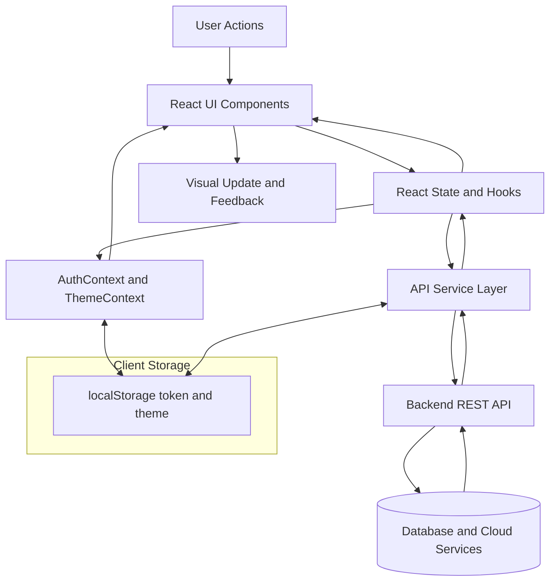

# Front-End Design of CUET ConnectX

## 1. Introduction
CUET ConnectX is a web platform built to connect CUET students and alumni through professional networking, career opportunities, and community engagement. The front-end objective was to design a responsive and user-friendly interface using HTML structure (through JSX), CSS styling, and JavaScript-based interactivity.

Core functionalities for user goals include:
- Account creation and login with email verification support.
- Profile creation and editing with image upload.
- Browsing and filtering jobs and scholarships.
- Community discovery with follow and unfollow actions.
- Admin-gated area for moderation and management.

The design goal was to provide clear navigation, strong visual hierarchy, and smooth interactions on both desktop and mobile devices.

## 2. Basic Structure of the Webpage

### 2.1 UML Diagram (Major Front-End Components and Pages)

### 2.2 Dataflow Diagram (Frontend Data Movement)

### 2.3 HTML Structure of the Pages
Although the project uses React, each view is rendered as semantic HTML in the browser.

#### 2.3.1 Global Page Shell
- Root document starts with `<!DOCTYPE html>` and `<html lang="en">`.
- Metadata uses `<meta charset>`, `<meta name="viewport">`, and SEO tags.
- The app mounts into `

`.
- Shared shell structure is:
  - `<nav>` from Navbar component.
  - `<main>` wrapping routed page content.
  - `<footer>` from Footer component.

#### 2.3.2 Navigation and Footer
- Navbar uses links and buttons with icon support and responsive menu behavior.
- Common attributes include `aria-label`, `alt`, and conditional classes.
- Footer is structured with semantic lists and links (`<ul>`, `<li>`, `<a>`), plus contact and social sections.

#### 2.3.3 Page Content Patterns
- Home page: multiple `<section>` blocks (hero, features, CTA), cards, and call-to-action buttons.
- Login and Signup pages: `<form>` with `<label>`, `<input>`, `<button>`, and validation/error message areas.
- Jobs and Scholarships pages:
  - Search and filter area using `<input>`, `<select>`, and checkboxes.
  - Card/grid list with detail modals.
- Community page:
  - Filter panel plus card grid for member profiles.
  - Action buttons for follow/unfollow and profile navigation.
- Profile page:
  - Cover area, profile header, editable sections, and modal dialogs.

#### 2.3.4 Frequently Used Tags and Attributes
- Tags: `nav`, `main`, `section`, `footer`, `form`, `label`, `input`, `select`, `textarea`, `button`, `img`, `a`, `div`, `h1-h4`, `p`, `ul`, `li`.
- Attributes: `id`, `className`, `type`, `required`, `placeholder`, `value`, `onChange`, `onClick`, `alt`, `href`, `target`, `rel`, `aria-label`.

### 2.4 Screenshots (Basic Unstyled HTML Layouts)
Note: Replace these placeholders with actual screenshots captured after temporarily disabling CSS in browser DevTools.

- Figure 2.1 Home layout (unstyled)
  - Insert image: `screenshots/basic/home-unstyled.png`
- Figure 2.2 Login form layout (unstyled)
  - Insert image: `screenshots/basic/login-unstyled.png`
- Figure 2.3 Jobs page layout with filters (unstyled)
  - Insert image: `screenshots/basic/jobs-unstyled.png`
- Figure 2.4 Profile page section layout (unstyled)
  - Insert image: `screenshots/basic/profile-unstyled.png`

## 3. Styling Using CSS

### 3.1 Elements Considered During Styling
The following elements were styled using global CSS variables, utility classes, and reusable class patterns:
- Typography: headings, body text, labels, captions.
- Buttons: primary, secondary, ghost, and icon buttons.
- Inputs and forms: text fields, selects, textareas, checkbox areas.
- Cards: job cards, scholarship cards, community member cards.
- Navigation: desktop and mobile nav states, active links, dropdown menus.
- Modals and overlays: post forms, detail views, profile editing dialogs.
- States: loading spinners, empty states, success/error toasts, hover/focus effects.

### 3.2 Layout Models Used
- Flexbox:
  - Horizontal alignment for nav bars, button groups, card headers, and profile rows.
- CSS Grid:
  - Multi-column card layouts and responsive section grids.
- Responsive strategy:
  - Breakpoint-based adaptations using utility classes for mobile, tablet, and desktop.
- Theme strategy:
  - Light and dark mode classes, CSS variables, and context-driven toggling.

### 3.3 Styled Page Screenshots
Note: Replace placeholders with final styled captures.

- Figure 3.1 Home page (styled)
  - Insert image: `screenshots/styled/home-styled.png`
- Figure 3.2 Login page (styled)
  - Insert image: `screenshots/styled/login-styled.png`
- Figure 3.3 Jobs page with filters and cards (styled)
  - Insert image: `screenshots/styled/jobs-styled.png`
- Figure 3.4 Community page card grid (styled)
  - Insert image: `screenshots/styled/community-styled.png`
- Figure 3.5 Profile page (styled)
  - Insert image: `screenshots/styled/profile-styled.png`

## 4. Interactive UI

### 4.1 Pure JavaScript Usage
Vanilla JavaScript logic is used inside React components and service modules for dynamic behavior:
- Form validation rules (student ID length, password checks, confirm password match).
- Event handling through button clicks, form submits, and input changes.
- Debounced search using `setTimeout` and `clearTimeout` for filter inputs.
- Slideshow timing on Home page using `setInterval` and cleanup on unmount.
- Click-outside handling for dropdown menus using event listeners.
- Browser APIs:
  - `localStorage` for token and theme persistence.
  - `navigator.share` and clipboard fallback for profile sharing.
- Fetch-based asynchronous API calls with error handling and custom error objects.

### 4.2 JavaScript Frameworks Used
- React (core framework):
  - Component-based UI architecture.
  - Hooks (`useState`, `useEffect`, `useMemo`, `useRef`, `useCallback`) for state and lifecycle logic.
  - Context API for global auth and theme state management.
- React Router:
  - Client-side route management.
  - Protected route behavior for admin-only pages.
- Vite:
  - Development server and optimized front-end build pipeline.

## 5. Discussion

### 5.1 Main Challenges and How They Were Addressed
1. Challenge: Keeping authentication state synchronized across pages.
   - Attempted solution: Centralized auth state in context and token-based initialization at app startup.

2. Challenge: Managing multiple filters without excessive API calls.
   - Attempted solution: Debounced search and memoized filter objects, plus simple response caching.

3. Challenge: Building responsive layouts with complex page sections.
   - Attempted solution: Combined Flexbox and Grid with breakpoint-specific utility classes.

4. Challenge: Handling image upload UX on profile pages.
   - Attempted solution: Added upload loading states, menu controls, and fallback avatars.

5. Challenge: Session-expiry and unauthorized API behavior.
   - Attempted solution: Unified API layer with custom error handling and forced logout event dispatch.

### 5.2 Unimplemented or Partially Implemented Features
- Job and scholarship "post" modals currently add items to local UI state in the page component; full backend persistence from these specific UI forms is only partially integrated.
- A dedicated Events and Meetups page is referenced in navigation text, but not yet implemented as a separate route/page.
- Automated frontend test coverage is not yet present in the current implementation.

## Appendices
- Frontend source code repository:
  - https://github.com/sayed-115/cuet-connectx-frontend

- Suggested screenshot naming convention:
  - `screenshots/basic/*.png` for unstyled layout captures
  - `screenshots/styled/*.png` for styled UI captures
